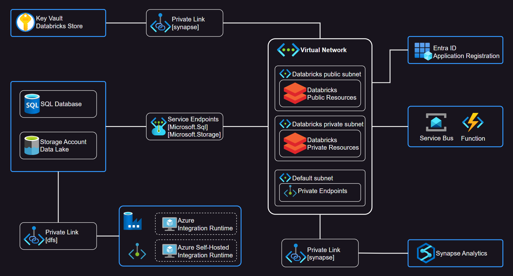

# Azure - Data Services

In this demo a solution named Databoss will be used to connect and apply Azure data services.

This is the high-level design with main components adn the data flow:


This project is implemented almost fully within private network architecture, making use of Private Link and Service Endpoints to securely connect to resources.



## Infrastructure

### 🚀 1 - Azure resources creation

Copy the `.auto.tfvars` template:

```sh
cp templates/template.tf .auto.tfvars
```

Check your public IP address to be added in the firewalls allow rules:

```sh
dig +short myip.opendns.com @resolver1.opendns.com
```

Add your public IP address to the `public_ip_address_to_allow` variable.

Apply and create the Azure infrastructure:

```sh
terraform init
terraform apply -auto-approve
```

Pause the Synapse SQL pool to avoid costs while setting up the infrastructure:

```sh
az synapse sql pool pause -n pool1 --workspace-name synw-databoss -g rg-databoss
```

Once the `apply` phase is complete, approve the managed private endpoints for ADF:

```sh
bash scripts/approveManagedPrivateEndpoints.sh
```

💡 A single connection to Databricks is required to create the access policies on Azure Key Vault.

If everything is OK, proceed to the next section.

### 💾 2 - Data setup

Upload some test data:

```sh
bash scripts/uploadFilesToDataLake.sh
bash scripts/uploadFilesToExternalStorage.sh
```

Run the ADF pipeline import data from the external storage into the data lake:

```sh
az datafactory pipeline create-run \
    --resource-group rg-databoss \
    --name Adfv2CopyExternalFileToLake \
    --factory-name adf-databoss
```

### 🟦 3 - Synapse

If you've stopped the Synapse pool, `resume` it:

```sh
az synapse sql pool resume -n pool1 --workspace-name synw-databoss -g rg-databoss
```

Create the template scripts in Synapse:

```sh
bash scripts/createSynapseSQLScripts.sh
```

Now, connect to Synapse Web UI or directly to the SQL endpoint and and execute the scripts.


### 🧰 4 - Databricks cluster configuration

The previous Azure run should have created the `databricks/.auto.tfvars` file to configure Databricks.

Apply the Databricks configuration:

> 💡 If you haven't yet, you need to login to Databricks, which will create Key Vault policies.

```sh
terraform -chdir="databricks" init
terraform -chdir="databricks" apply -auto-approve
```

Check the workspace files and run the test notebooks and make sure that connectivity is complete.


### 🗲 5 - Function

#### Deployment

Deployment command:

```sh
func azure functionapp publish <FunctionAppName>
```

### Local Development

Create the virtual environment:

```sh
python -m venv venv
. venv/bin/activate
pip install -r requirements.txt

deactivate
```

Start the function:

```sh
func start
```

Get the Service Bus connection string:

```sh
az servicebus namespace authorization-rule keys list -n RootManageSharedAccessKey --namespace-name bus-databoss -g rg-databoss
```

Create the `local.settings.json` file:

```json
{
  "IsEncrypted": false,
  "Values": {
    "FUNCTIONS_WORKER_RUNTIME": "python",
    "AzureWebJobsFeatureFlags": "EnableWorkerIndexing",
    "AzureWebJobsStorage": "",
    "AzureWebJobsServiceBusConnectionString": ""
  }
}
```

## Extra subjects

- Consume IP addresses
- Internal runtime
- Code repository
- AD permissions
- Azure Monitor (Logs, Insights)
- Enable IR interactive authoring

## 🧹 Clean-up

Delete the Databricks configuration:

```sh
terraform -chdir="databricks" destroy -auto-approve
```

Delete the Azure infrastructure:

```sh
terraform destroy -auto-approve
```

## Reference

- [Tutorial: ADLSv2, Azure Databricks & Spark](https://learn.microsoft.com/en-us/azure/storage/blobs/data-lake-storage-use-databricks-spark)
- [ADF Private Endpoints](https://learn.microsoft.com/en-us/azure/data-factory/managed-virtual-network-private-endpoint#managed-private-endpoints)
- [Integration runtime in Azure Data Factory](https://learn.microsoft.com/en-us/azure/data-factory/concepts-integration-runtime)
- [Connect to Azure Data Lake Storage Gen2 and Blob Storage](https://learn.microsoft.com/en-us/azure/databricks/storage/azure-storage)
- [Azure Databricks: Manage service principals](https://learn.microsoft.com/en-us/azure/databricks/administration-guide/users-groups/service-principals)
- [Azure Databricks: Query data in Azure Synapse Analytics](https://learn.microsoft.com/en-us/azure/databricks/external-data/synapse-analytics)
- [Azure Synapse: Azure Private Link Hubs](https://learn.microsoft.com/en-us/azure/synapse-analytics/security/synapse-private-link-hubs)
